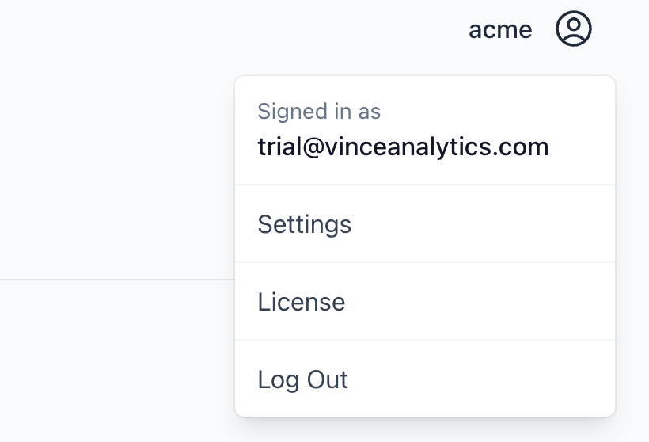
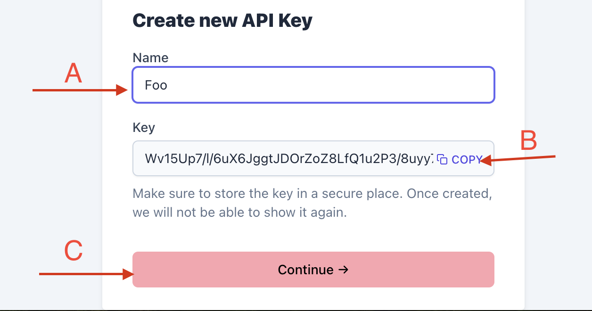
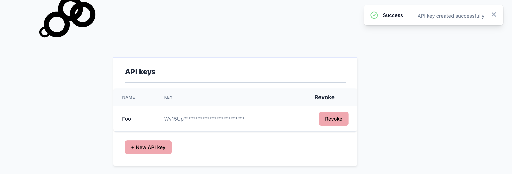

`vince` supports using api keys to access api endpoints. Keys generated, have universal permissions, there is no support for fine grained access control.

## Go to settings
__*Top-Right*__: click on the person icon with admin name and select `settings`

## User settings page

On the user setttings page under API keys section click on new api key

## API keys form

- __A__: The name of the api key.
- __B__: The generated api key. You must copy this and store somewhere safe, we never store this value and there is no way to recover it after you exit this page.
- __C__: Submits the api key form.

If all is well you should be redirected back to the user setting page and the new api key should be visible.

